<div align="center">


<br />

**A CRM built for a single gym: leads, members, check-ins, payments, renewals and the sales team, in one place.**

[](https://pulse-ebon-eight.vercel.app)


-15A05A)

[Try it](#try-it-in-30-seconds) · [Tour](#take-the-tour) · [Demo script](#a-5-minute-demo) · [Run locally](#run-it-locally) · [Deploy](#deploy-to-vercel) · [How it works](#how-it-works)

</div>

---

Pulse is a working demo of a gym CRM, set up for **Ironhouse Fitness** (amounts in ₹, Indian phone numbers). Every button does something, and every number agrees with every other number: convert a lead and the dashboard, sales team, payments and renewal targets all update together. It runs entirely in the browser with realistic mock data, so there's nothing to set up.

<div align="center">
  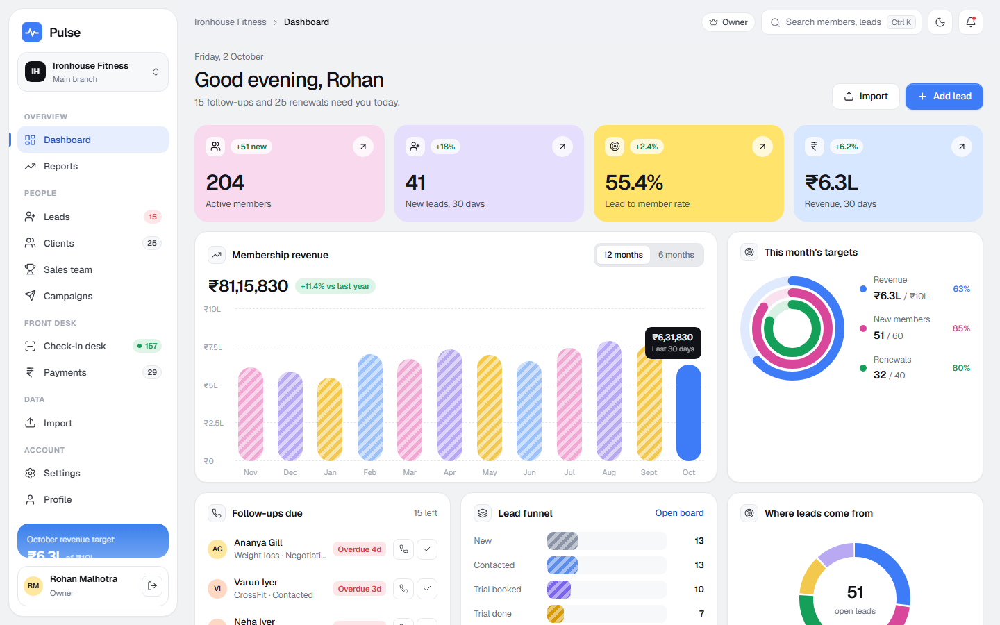
</div>

## Try it in 30 seconds

Open **[pulse-ebon-eight.vercel.app](https://pulse-ebon-eight.vercel.app)**, pick a role on the sign-in screen and click **Sign in**. The password is already filled in (`ironhouse2026`).

| Role | Person | What they see |
|---|---|---|
| **Owner** | Rohan Malhotra | Everything: dashboards, reports, team, payments, settings |
| **Sales** | Priya Nair | Their own leads and follow-ups, the sales leaderboard, campaigns, import |
| **Front desk** | Neha Joshi | Check-in desk, payments and dues, walk-in enquiries |
| **Member** | Simran Kaur | The member's phone app: streak, pass, visits, plan |

> [!TIP]
> Everything you change is saved in your browser, so it's still there next time. To start fresh, clear this site's data in your browser (Chrome: the icon left of the address bar → **Site settings → Delete data**).

## Take the tour

Click any section to open it.

<details>
<summary><b>Leads: table and drag-and-drop board</b></summary>
<br />

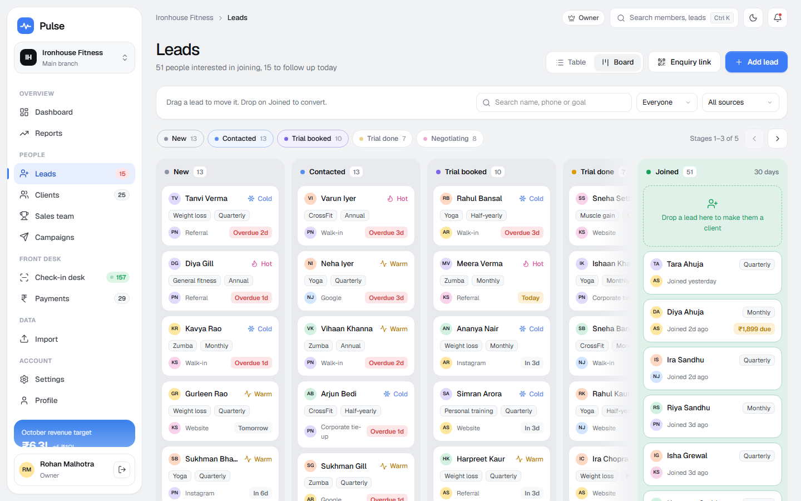

- Table with tabs (All, Due today, Hot, New this week, Imported, Lost), search, filters, sorting and bulk assign or export.
- Board view: drag a lead between stages, or drop it on **Joined** to make them a member. Stage chips and arrows move along the columns, and you can drag the background to pan.
- Lead drawer: call, WhatsApp, change stage or owner, reschedule the follow-up, add notes, convert, or mark as lost.

</details>

<details>
<summary><b>Clients: membership card with a real QR code</b></summary>
<br />

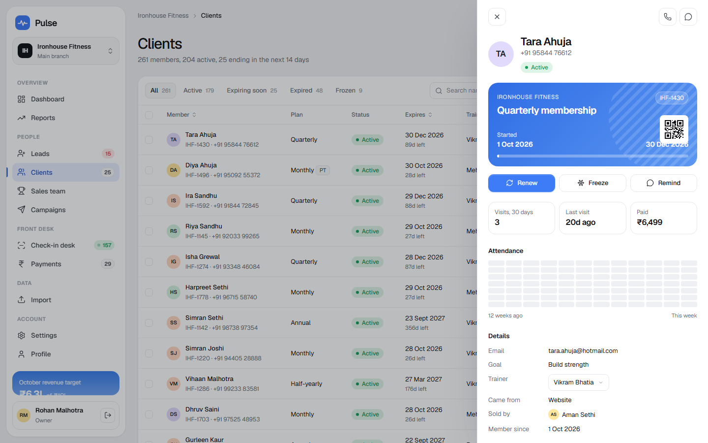

- Status tabs: Active, Expiring soon, Expired, Frozen, Imported.
- The membership card changes colour with status and carries a scannable QR code of the member number.
- Renew (any unpaid balance carries over), freeze or unfreeze, collect dues, a 12-week attendance grid, and the full payment history.

</details>

<details>
<summary><b>Check-in desk: keypad, scan and kiosk mode</b></summary>
<br />

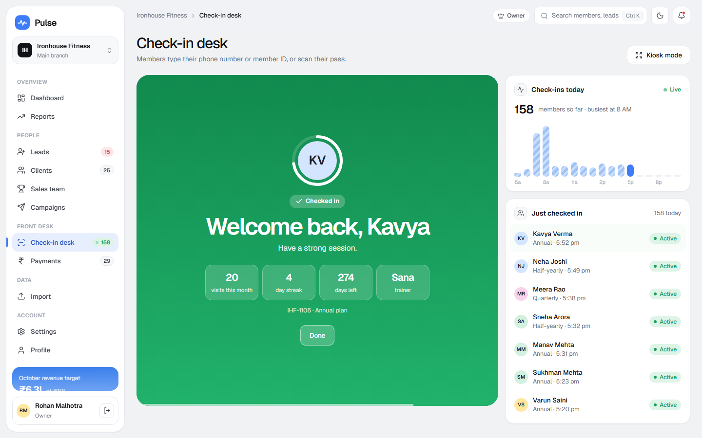

- Members type a 10-digit phone number or a 4-digit member ID, on screen or with the keyboard.
- Six results: welcome, plan ending soon, expired, frozen, already in today, and not found (add as a lead).
- **Demo scan** of a member pass, and a full-screen **Kiosk mode** for a tablet at reception.

</details>

<details>
<summary><b>Payments: GST tax invoices</b></summary>
<br />

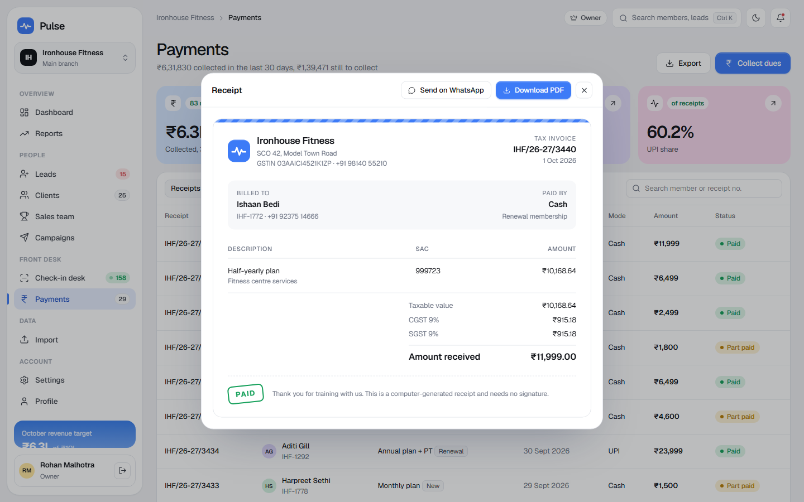

- Receipts and pending dues, collecting part payments, and exporting to CSV.
- Every receipt splits 18% GST into CGST and SGST (SAC 999723), exact to the paisa. **Download PDF** prints only the receipt.

</details>

<details>
<summary><b>WhatsApp campaigns: composer with a live phone preview</b></summary>
<br />

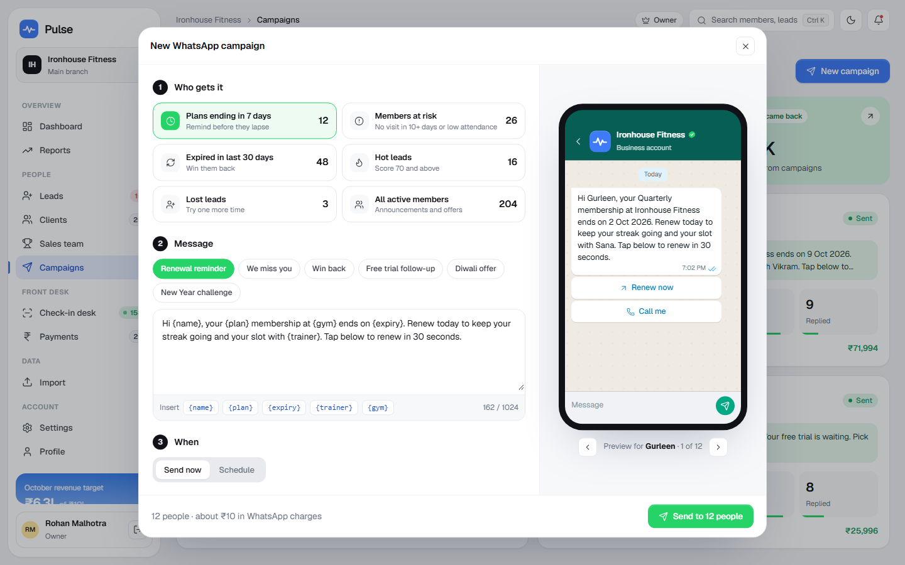

- Six audiences (ending in 7 days, at risk, expired, hot leads, lost leads, all active), each with a live count.
- Templates with `{name}` `{plan}` `{expiry}` `{trainer}` `{gym}` fields, previewed for each real recipient.
- Send now or schedule. Delivered, read, replied and renewed numbers fill in live after sending.

</details>

<details>
<summary><b>Reports: renewal forecast and retention</b></summary>
<br />

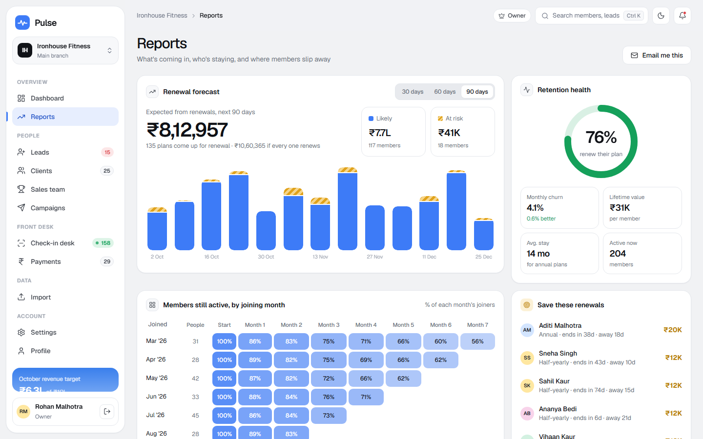

- Expected renewal revenue for the next 30, 60 or 90 days, split into likely and at-risk.
- Retention health, a cohort heatmap, how attendance predicts renewal, and revenue by plan.
- **Message all at-risk members** opens the campaign composer with that group selected.

</details>

<details>
<summary><b>Import: Excel, CSV, Word or text</b></summary>
<br />

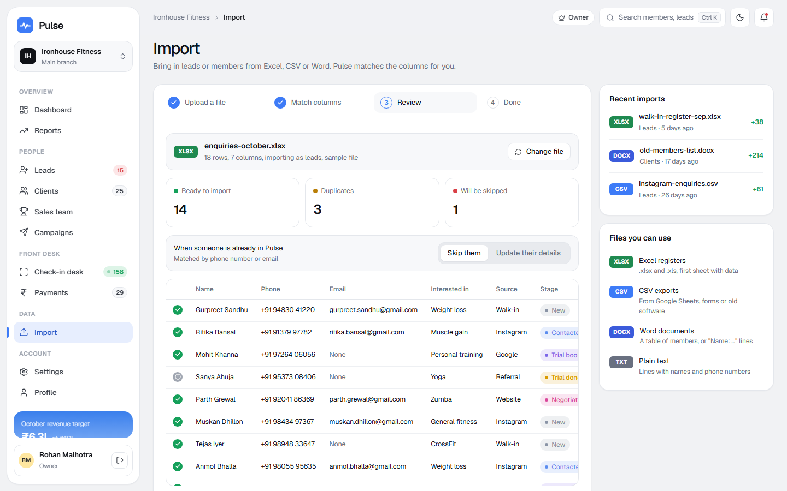

- Import leads or members. Columns are matched for you, even messy ones like "Membership Start Date" or "Contact No".
- Review shows what's ready, what's a duplicate and what will be skipped, and why. You can skip duplicates or update them.
- Try it with the built-in sample files, or with [`docs/gym-members-sample.docx`](docs/gym-members-sample.docx) (11 ready, 1 duplicate, 1 skipped).

</details>

<details>
<summary><b>Enquiry link: get leads while you sleep</b></summary>
<br />

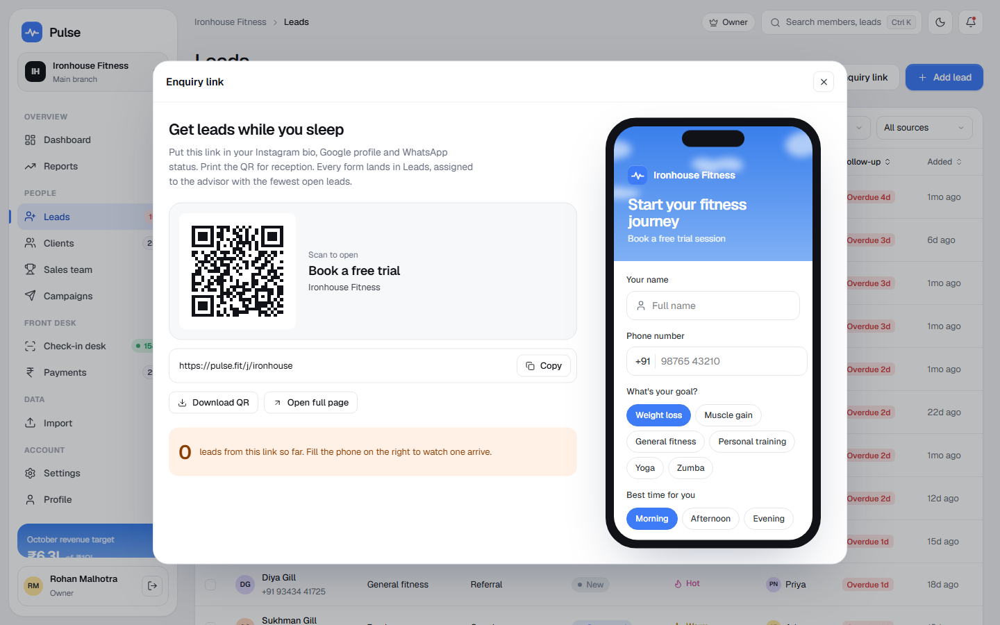

- A shareable link and QR code for Instagram, Google or reception. The phone on the right runs the real form.
- Every enquiry lands in Leads straight away, assigned to the advisor with the fewest open leads. A second open tab updates too.

</details>

<details>
<summary><b>The member app</b></summary>
<br />

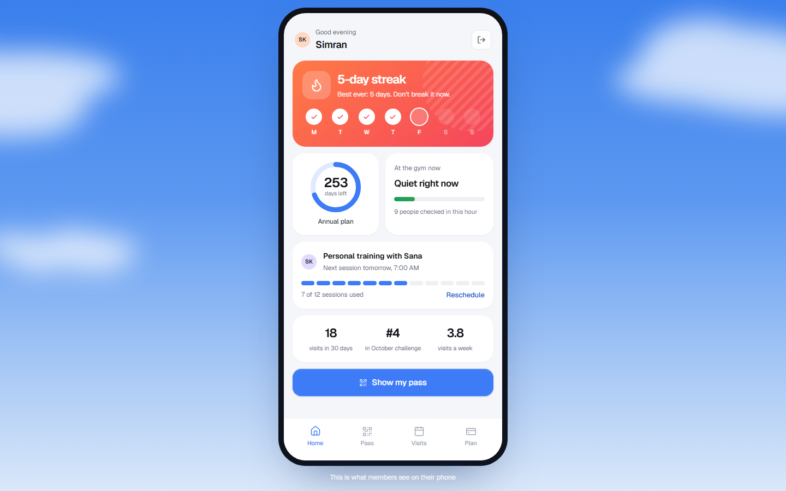

- Streak, days left, how busy the gym is right now, PT sessions, and a scannable pass with **Check in now**.
- A visit calendar, and renew or upgrade with a simulated UPI payment. The receipt appears in staff Payments.

</details>

<details>
<summary><b>Dark mode</b></summary>
<br />

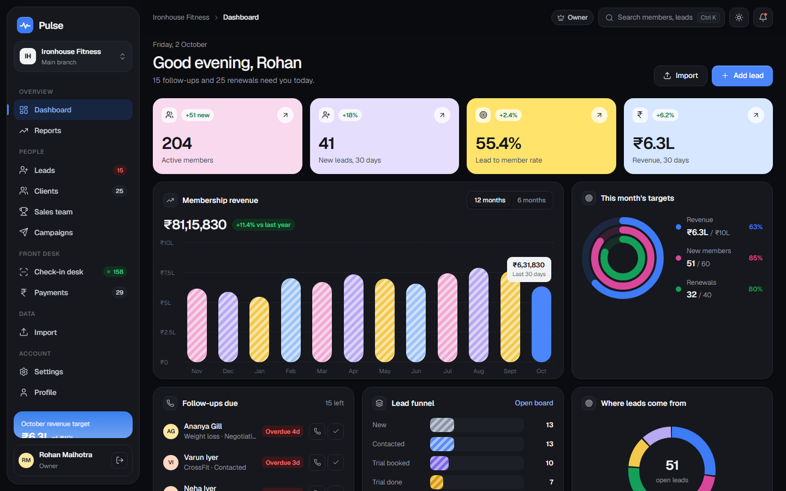

Follows your device setting, or switch with the moon icon in the top bar or under **Settings → Appearance**.

</details>

## A 5-minute demo

1. **Sign in as Owner.** The dashboard shows today: follow-ups due, members at risk, revenue against target.
2. **Leads → Board.** Drag a lead from *Trial done* onto **Joined**. Pick *Half-yearly*, enter **3000** as the amount received, and confirm.
3. See it everywhere: the member drawer shows **₹8,999 due**, the lead now appears in the Joined column, and **Payments → Pending dues** lists them.
4. **Check-in desk.** Tap the *Active* demo member: a green welcome, and the count in the sidebar goes up. Try *Expired* to see a member being stopped at the door.
5. **Import.** Choose *Clients*, drop in `docs/gym-members-sample.docx`, and watch 11 members arrive with their receipts.
6. **Sign out and in as Member** (Simran). Tap **Pass → Check in now**, then sign back in as Front desk: she's at the top of the *Just checked in* list.

## Run it locally

You need **Node.js 20.19+ or 22.12+**.

```bash
git clone https://github.com/samrat10000/pulse.git
cd pulse
npm install
npm run dev
```

Then open **http://localhost:5173**.

| Command | What it does |
|---|---|
| `npm run dev` | Development server with hot reload |
| `npm run build` | Type-check and build into `dist/` |
| `npm run preview` | Serve the production build locally |
| `npm run lint` | Lint with oxlint |

## Deploy to Vercel

No config file is needed: Vercel detects Vite on its own.

```bash
npm i -g vercel
vercel          # preview link
vercel --prod   # production link
```

Or import the repo at [vercel.com/new](https://vercel.com/new). Links use `#/` routes, so refreshing any page never gives a 404 on any static host.

## How it works

How a person moves through the gym, and what every step updates:

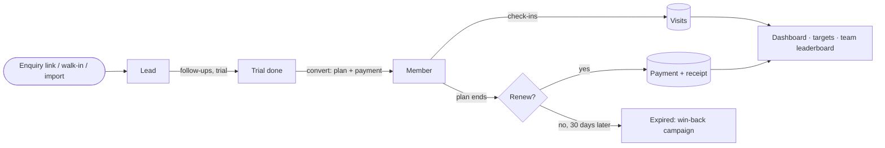

- **One store, one source of truth.** All data lives in a single Zustand store. Every figure (revenue, dues, new members, conversion) is worked out from the underlying records, so pages can't disagree.
- **Saved in the browser.** Data is kept in `localStorage`. Dates are stored as days from today and shift forward when you come back on a later day, so "due today" stays correct.
- **Seeded mock data.** 54 leads, 260 members, payments and today's check-ins are generated from fixed seeds, so every fresh start shows the same gym.

### Real vs simulated

| Real | Simulated |
|---|---|
| QR codes (they scan) | WhatsApp sending, delivery and read counts |
| Excel / CSV / Word import | UPI payment in the member app |
| GST maths on every receipt | The camera in "Demo scan" |
| Login music (made in the browser, no audio files) | Calls, emails and "Email me this" |
| Saving to the browser | Sign-in (no real authentication) |

### Project structure

```
src/
├─ app/          the signed-in app: shell, sidebar, palette, one folder per page
├─ auth/         sign-in page
├─ member/       the member's phone app
├─ join/         public free-trial page and form
├─ components/   shared UI (buttons, drawers, modals, rings, receipt, hill, clouds)
├─ data/         types, seeded mock data, derived rules, browser persistence
├─ import/       file parsing, column matching, row validation, sample files
├─ store/        the single Zustand store with every action
├─ lib/          formatting (₹, dates), seeded random, QR, music, helpers
└─ styles/       design tokens, light and dark themes, all component styles
```

### Built with

React 19 · TypeScript (strict) · Vite · Tailwind CSS v4 · Zustand · React Router 7 (hash routes) · Motion · dnd-kit · cmdk · SheetJS · Mammoth · Papa Parse · qrcode · Lucide icons · Geist font

### Keyboard shortcuts

| Keys | Action |
|---|---|
| <kbd>Ctrl</kbd> / <kbd>⌘</kbd> + <kbd>K</kbd> | Search members, leads and pages |
| <kbd>Esc</kbd> | Close a drawer, dialog or check-in result |
| <kbd>0</kbd>–<kbd>9</kbd>, <kbd>Enter</kbd> | Type and submit at the check-in desk |
| <kbd>Space</kbd>, <kbd>←</kbd> <kbd>→</kbd> | Pick up a lead card and move it between columns |
